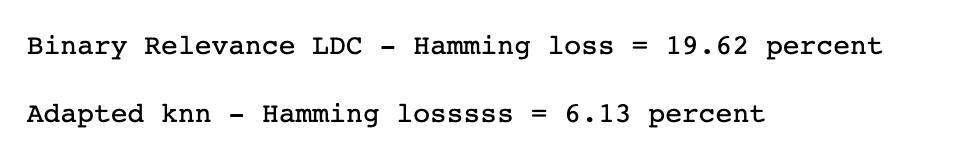
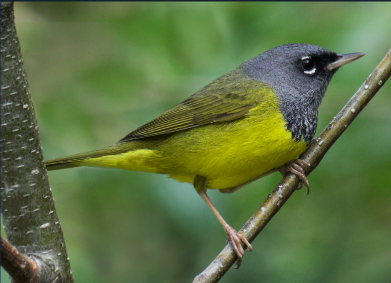
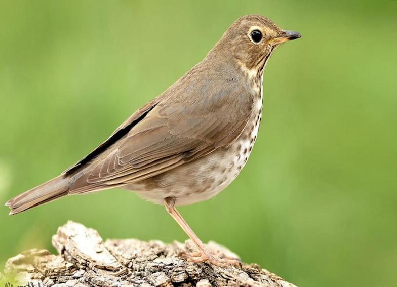

# **Multilabel Classification**
This project uses the adapted k-nearest neighbor and the Binary Relevance LDC classifiers to find out which is the best and worst recognised birds from the birds data set.

## **Introduction**
Bird behavior and population are two important indicators in nature conservation but measuring them is a hard process. For example, the most widely used method to measure birds population is making estimations based on point counts of the birds that birdwatchers had heard or seem.  
A complementary method to the traditional ones, involves an automated acoustic monitoring of birds. This method allows long recording birds vocalisation and it does not need of an observer. Furthermore, the recording in ecologically sensitive or inhospitable areas are posible with this method.

According to Briggs et al.[1], the major challenges include multiple simultaneously vocalizing birds, other sources of non-bird like buzzing insects, and background noise like wind, rain and motor vehicles.

Hence, the purpose of this project is to identify the most and least well recognized birds from a birds data set using the Binary Relevance LDC and the Addapted k-nearest neighbor classifier.

## **Data set description**
As reported by Briggs et al.[1] the birds data set is a representative sample of the audio data set collected in the H. J. Andrews (HJA) Long-Term Experimental Research Forest, in the Cascade mountain range of Oregon. The birds data set has been pre-processed and has the following characteristics:

1. Number of objects N = 645
2. Number of features n = 260
3. Number of classes c = 19 as we see in "Table 1"
4. Average number of labels associated with each instance or cardinality = 1.014

Furthermore, the data was splitted into training and testing data and stored in separated files.

Table 1. Bird Species

**Code** | **Name**
---------|---------
BRCR | Brown Creeper
PAWR | Pacific Wren
PSFL | Pacific-slope Flycatcher
RBNU | Red-breasted Nuthatch
DEJU | Dark-eyed Junco
OSFL | Olive-sided Flycatcher
HETH | Hermit Thrush
CBCH | Chestnut-backed Chickadee
VATH | Varied Thrush
HEWA | Hermit Warbler Swainson’s Thrush
SWTH | Swainson’s Thrush
HAFL | Hammond’s Flycatcher
WETA | Western Tanager
BHGB | Black-headed Grosbeak
GCKI | Golden Crowned Kinglet
WAVI | Warbling Vireo
MGWA | MacGillivray’s Warbler
STJA | Stellar ’s Jay
CONI | Common Nighthawk

## **Multi-label classification methods**
To solve our problem we will use multilabel classification methods like Adapted k-nearest neighbor and the Binary Relevance method.

According Tsoumakas et al.[2], Godbole et al. [3] and Zhang et al.[4] the Binary Relevance method transforms a multi-label problem into multiple binary problems; one problem for each label, such that each binary model is trained to predict the relevance of one of the labels.

The multi-label k-nearest neighbor is derived from the popular k-nearest neighbor. Also, as reported by Zhang et al.[5] to implement this classifier first, the k-nearest neighbors in the training set are identified. Then, the number of neighboring instances belonging to each possible class, maximum a posteriori (MAP) principle is utilized to determine the la- bel set for the test instance. 

This project implemented the Binary Relevance Method for multilabel classification using the Linear Discriminant classifier and the multi-label k-nearest neighbor to identify the most and least well recognized bird from the birds data set.

Finally, we calculated Hamming loss to know which is the best multi-label classifier and identified which is the best and worst recognised birds.

## **Results**
As we see in "Figure 1", the hamming loss calculated after using Adapted knn classifier shows the lowest value of 6.13%, so this classifier is the best because it considered the dependencies between class labels. On the other hand, the Binary Relevance LDC presents a higher value of 19.62% since it divides this problem into independant single problems.

 
 Figure 1. Hamming loss of Binary Relevance LDC and adapted k-nn classifiers

Since the multi-label k-nearest neighbor is our best multi-label classifier, then we calculated the best and worst recognized birds which are MacGillivray’s Warbler and Swainson’s Thrush as we see in the "Figure 2" and "Figure 3".

 
 Figure 2. The most well recognized bird

 
 Figure 2. The least well recognized bird

## **References**
 [1] [6] F. Briggs, Y. Huang, R. Raich, K. Eftaxias, Z. Lei, W. Cukierski, S. F. Hadley, A. Hadley, M. Betts, X. Z. Fern, J. Irvine, L. Neal, A. Thomas, G. Fodor, G. Tsoumakas, H. W. Ng, T. N. T. Nguyen, H. Huttunen, P. Ruusuvuori, T. Manninen, A. Diment, T. Virtanen, J. Marzat, J. Defretin,
D. Callender, C. Hurlburt, K. Larrey, and M. Milakov, “The 9th annual mlsp competition: New methods for acoustic classification of multiple simultaneous bird species in a noisy environment,” in 2013 IEEE International Workshop on Machine Learning for Signal Processing (MLSP), pp. 1–8, 2013.
 [2] G. Tsoumakas and I. Katakis, “Multi-label classification: An overview,” International Journal of Data Warehousing and Mining (IJDWM), vol. 3, no. 3, pp. 1–13, 2007. 1
 [3] S. Godbole and S. Sarawagi, “Discriminative methods for multi-labeled classification,” in Advances in Knowledge Discovery and Data Mining (H. Dai, R. Srikant, and C. Zhang, eds.), (Berlin, Heidelberg), pp. 22–30, Springer Berlin Heidelberg, 2004.
 [4] M.-L. Zhang and Z.-H. Zhou, “A k-nearest neighbor based algorithm for multi-label classification” 2005 IEEE International Conference on Granular Computing, vol. 2, pp. 718–721 Vol. 2, 2005. 1
 [5] M.-L. Zhang and Z.-H. Zhou, “Ml-knn: A lazy learning approach to multi-label learning,” Pattern Recognition, vol. 40, no. 7, pp. 2038–2048, 2007.

